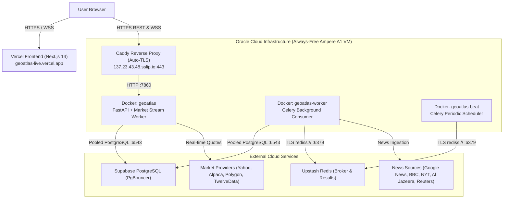

# GeoAtlas 🌍📈

**GeoAtlas** is a real-time geopolitical intelligence and market prediction platform. It continuously ingests global news, extracts macroeconomic and geopolitical events using calibrated NLP pipelines, maps them to financial assets via an interactive Knowledge Graph, and predicts market impacts using machine learning models (`GeoAtlas-Ensemble-v1`).

---

## 🌐 Live Deployments

| Component | Platform | URL / Endpoint |
| :--- | :--- | :--- |
| **Frontend Web App** | Vercel (Next.js 14) | [https://geoatlas-live.vercel.app](https://geoatlas-live.vercel.app) |
| **Backend REST & WS API** | Oracle Cloud Ampere A1 (Caddy SSL) | [https://137.23.43.48.sslip.io](https://137.23.43.48.sslip.io) |
| **API Documentation** | Swagger / OpenAPI | [https://137.23.43.48.sslip.io/docs](https://137.23.43.48.sslip.io/docs) |
| **System Health & Circuits** | Monitoring Telemetry | [https://137.23.43.48.sslip.io/health](https://137.23.43.48.sslip.io/health) |

---

## 🏛️ System Architecture



GeoAtlas is engineered as a **modular monolith** with asynchronous, event-driven background services:

1. **FastAPI Web Server (`geoatlas` container)**:
   - High-throughput asynchronous REST endpoints, WebSocket market quote streams, and user authentication.
   - Non-blocking database write buffering via `DBBuffer` to avoid connection pool exhaustion.
   - Circuit breakers with adaptive rate-limiting per market data provider.

2. **Celery Worker (`geoatlas-worker` container)**:
   - Ingests raw articles from multiple Tier-1 news outlets and wire services.
   - Sanitizes text, strips markup, and hashes content (`SHA-256`) for deduplication.
   - Executes multi-stage NLP gating (language validation, keyword relevance scoring, event extraction, and sentiment calculation).
   - Dynamically links events to assets via Knowledge Graph expansion (L1 direct mentions, L2 sector links).

3. **Celery Beat Scheduler (`geoatlas-beat` container)**:
   - Dispatches recurring cron schedules (RSS ingestion every 10 min, article event extraction every 5 min, rolling feature computation every 3 min).

4. **Caddy Reverse Proxy**:
   - Manages automated Let's Encrypt SSL/TLS certificates via wildcard DNS (`137.23.43.48.sslip.io`).
   - Handles HTTP/2, HTTP/3, and automatic WebSocket protocol upgrading (`wss://`).

---

## 🛠️ Tech Stack

### Backend & Machine Learning
* **Language & Framework:** Python 3.11+, FastAPI, SQLAlchemy (Asyncio), Pydantic v2
* **Asynchronous Workers:** Celery, Upstash Redis (Task Broker & Result Backend with TLS)
* **Database:** PostgreSQL (Supabase with PgBouncer transaction pooling)
* **NLP & Information Extraction:** spaCy (`en_core_web_sm`), Hugging Face Transformers, custom heuristic & scikit-learn classifiers
* **Time-Series & Prediction:** Amazon Chronos-Forecasting (T5 time-series foundation model), PyTorch, XGBoost, VolatilityNet

### Data Ingestion & Market Feeds
* **Market Quotes:** Yahoo Finance (`yfinance`), Alpaca Market Data API (IEX real-time), Binance, Polygon, TwelveData.
* **Geopolitical & Macro Feeds:** BBC World, Google News (World & Business), The New York Times, Al Jazeera, The Guardian, Deutsche Welle, Reuters, NewsAPI, GDELT 2.0.

### Frontend
* **Framework:** Next.js 14 (App Router), React, TypeScript
* **Styling & UI:** Tailwind CSS, ShadCN UI primitives, Lucide Icons
* **Data Fetching & State:** TanStack React Query, Axios, Native WebSockets
* **Visualizations:** Recharts (interactive price & trend charts), Leaflet / SVG geopolitical maps

---

## ✨ Core Features

* **Real-Time Geopolitical Event Extraction:** Translates breaking global news into structured intelligence with severity scores, confidence levels, country tags, and affected assets.
* **Knowledge Graph Asset Mapping:** Links geopolitical crises directly to equity tickers, commodities (Gold, Crude Oil, Natural Gas), and sector ETFs through supply-chain relationships.
* **Live Multi-Asset Market Stream:** Low-latency price tracking across Crypto, Equities, and Commodities with automatic circuit breakers to protect against provider outages.
* **Interactive Hotspot Intelligence Map:** Geographical dashboard displaying high-severity flashpoints, event clusters, and regional geopolitical risk scores.
* **Automated Event Moderation:** Two-tier confidence system: high-confidence events (`>= 0.60`) are auto-approved for public map display, while borderline signals are routed to the review queue.
* **Zero Secret Leakage Architecture:** Production credentials, database passwords, and private keys are never committed to source control and are loaded dynamically from environment variables at runtime.

---

## 🚀 Getting Started Locally

### Prerequisites
* Python 3.11+
* Node.js 18+
* PostgreSQL & Redis (or Supabase & Upstash accounts)
* Docker (optional, for containerized execution)

---

### 1. Backend Setup

```bash
cd backend

# Create and activate a virtual environment
python -m venv venv
# On Windows:
venv\Scripts\activate
# On Linux/macOS:
source venv/bin/activate

# Install dependencies
pip install -r requirements.txt

# Download spaCy NLP model
python -m spacy download en_core_web_sm

# Configure environment variables
cp .env.example .env
# Edit .env with your PostgreSQL, Redis, and API credentials

# Run database migrations
alembic upgrade head

# Start the FastAPI development server
uvicorn main:app --reload --port 7860
```

---

### 2. Background Workers (Separate Terminals)

```bash
cd backend
source venv/bin/activate  # Or venv\Scripts\activate on Windows

# Terminal 1: Celery Worker
celery -A workers.celery_app worker --loglevel=info --concurrency=2

# Terminal 2: Celery Beat Scheduler
celery -A workers.celery_app beat --loglevel=info
```

---

### 3. Frontend Setup

```bash
cd frontend

# Install dependencies
npm install

# Configure environment variables
echo "NEXT_PUBLIC_API_URL=http://localhost:7860/api/v1" > .env.local

# Run development server
npm run dev
```
Open [http://localhost:3000](http://localhost:3000) in your browser.

---

## 🐳 Production Deployment (Oracle Cloud VM / Docker)

To run the entire backend stack in production via Docker:

```bash
# 1. Build the production Docker image
cd backend
docker build -t geoatlas-backend .

# 2. Run the FastAPI REST API & Market Streaming container
docker run -d --name geoatlas --restart always \
  -p 7860:7860 \
  --env-file .env \
  geoatlas-backend

# 3. Run the Celery Worker container
docker run -d --name geoatlas-worker --restart always \
  --env-file .env \
  geoatlas-backend \
  celery -A workers.celery_app worker --loglevel=info --concurrency=2

# 4. Run the Celery Beat Scheduler container
docker run -d --name geoatlas-beat --restart always \
  --env-file .env \
  geoatlas-backend \
  celery -A workers.celery_app beat --loglevel=info
```

### Reverse Proxy & SSL Setup (Caddy)
To securely proxy traffic from Vercel to your VM with automatic Let's Encrypt certificates:
```caddyfile
# /etc/caddy/Caddyfile
<your-ip>.sslip.io {
    reverse_proxy localhost:7860
}
```

---

## 📂 Repository Structure

```text
GeoAtlas/
├── backend/                      # Backend Service & Background Pipeline
│   ├── core/                     # Configuration, Database engine, HTTP clients, Metrics
│   ├── modules/                  # Modular domain routers, models, and business logic
│   │   ├── events/               # Geopolitical event extraction & news routers
│   │   ├── market/               # Market snapshot, quotes, and asset catalog
│   │   ├── predictions/          # Prediction engine & model runners
│   │   ├── users/                # Auth, JWT, billing & user profiles
│   │   └── boards/               # Custom intelligence boards, pins & alerts
│   ├── workers/                  # Celery tasks (RSS ingestion, event pipeline, market snapshot)
│   ├── scripts/                  # DB seeders, sanitization, and manual batch inference tools
│   ├── alembic/                  # Database migration versions
│   ├── Dockerfile                # Production container specification (ARM64 & x86_64)
│   └── main.py                   # FastAPI application entrypoint
├── frontend/                     # Next.js 14 Web Application
│   ├── src/app/                  # App Router pages (Feed, Map, Predictions, Boards, Alerts)
│   ├── src/components/           # UI Components (MarketPanel, EventPin, GeoHeatmapWidget)
│   └── src/lib/                  # API client, date utilities, helper functions
├── keys/                         # Server access keys (Strictly gitignored)
├── .gitignore                    # Git rules preventing key or secret commits
└── README.md                     # Project Overview & System Documentation
```

---

## 🔒 Security & Privacy

* **Zero Hardcoded Secrets:** Fallback values in `core/config.py` are strictly empty strings. Secrets are exclusively sourced from environment variables at runtime.
* **Excluded Keys & State:** Private keys (`*.key`, `*.pem`), credentials (`.env`), and runtime logs are explicitly excluded via `.gitignore`.
* **Database Safeguards:** Configured with unnamed prepared statements (`statement_cache_size=0`) to ensure safe execution with Supabase's transaction pooler (PgBouncer).

---

## 📄 License
Proprietary. All rights reserved.
